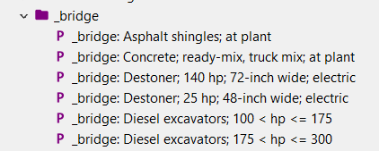

# autoprox
`autoprox` automatically generates bridge processes as described in
[Ingwersen et al. 2018](https://www.ncbi.nlm.nih.gov/pmc/articles/PMC6463304/)
directly in [openLCA](https://github.com/GreenDelta/olca-app). 
For a process `p` in a database with a set of background processes `Q`,
`autoprox` generates a set of bridge processes `B` that connect the product
inputs and waste outputs of `p` with corresponding product outputs and waste
inputs provided by the processes in `Q`. This is done by a
[Generator](src/main/kotlin/autoprox/Generator.kt) that takes the ID of the
process `p` and [Matcher](src/main/kotlin/autoprox/Matcher.kt) `M` as input.
For a product input or waste output `fp` of `p` that does not yet have a
provider process in `Q`, the matcher `M` generates a set of flow-score pairs
for the product outputs and waste inputs `fq` with a provider process in `Q`:

```
M: fp -> {(fq, sq) | fq in Q, sq in [0, 1]} 
```

The generator selects then the top matching flows of `fq` with the following
rule where `epsilon` can be configured:

```
abs(1.0 - (sq_i / max(sq))) <= epsilon
```

A bridge process `b` is then generated that has a corresponding exchange for
each of these matching product outputs or waste inputs. The quantitative
reference of `b` is set to one unit of `fp` and the amount of a matching flow
`fq_i` is set to:

```
sq_i^2 / (sum(sq) * max(sq))
```

Only flows are currently selected that have the same reference flow property
as `fp` so that every amount in `b` has the same unit. The name of `b` is
set to the name of the reference flow with a `_bridge:` prefix and all processes
of `B` are stored in the `_bridge` category so that it is easy to identify
(and delete) them:



For `p` it should be then possible to create a product system that uses the
generated bridge processes `B` to connect `p` with `Q`:


## Implemented matchers

### The `BigramsDiceMatcher`
This matcher extracts the [bigrams](https://en.wikipedia.org/wiki/Bigram) from
the words of the names of the flows that are compared and computes the
[Sørensen–Dice coefficient](https://en.wikipedia.org/wiki/S%C3%B8rensen%E2%80%93Dice_coefficient)
of these sets of bigrams. It is fast and simple and gives good results for
flow names that are relatively specific:


However, flow names in LCA names often contain terms like `at plant` or
`production mix` that will lead to imprecise results using this matcher
with out a filter:


### The `InfoContentMatcher`
The `InfoContentMatcher` computes the information content `I(w)` of a word `w`
as:

```
I(w) = |w| * e^(-alpha * freq(w))
```

`|w|` is the number of characters of `w` and `freq(w)` the absolute frequency of
`w` in the flow names of `fq`. With this long words that are less frequent get
a higher weight than terms like `at plant`. This fixes the `concrete`
example above:


However, words that have a high information content can describe completely
different products:


### The `WordNetPathMatcher`

The `WordNetPathMatcher` uses the [WS4j](https://code.google.com/archive/p/ws4j)
API to calculate semantic similarities between words using
[WordNet](https://wordnet.princeton.edu).

WS4j is an archived Google Code project and a bit complicated to set up (see
below) and is compatible with a relative old version of WordNet. An alternative
could be [JWI](http://projects.csail.mit.edu/jwi/) which supports to load
a current WordNet database from a folder (just download and extract the
[WordNet database files](http://wordnetcode.princeton.edu/3.0/WNdb-3.0.tar.gz)
to that folder):

```kotlin
val wordNetPath = "C:/Users/ms/Downloads/WNdb-3.0/dict"
val dict = RAMDictionary(File(wordNetPath), ILoadPolicy.NO_LOAD)
dict.open()
val idxWord = dict.getIndexWord("asphalt", POS.NOUN)
if (idxWord != null) {
    val word = dict.getWord(idxWord.wordIDs[0])
    word.synset.relatedSynsets.
}
```

However, WS4j provides a lot of features and
[algorithms](http://ws4jdemo.appspot.com) that can be used easily while JWI
provides a more low level API (but with a nice
[tutorial](http://projects.csail.mit.edu/jwi/download.php?f=edu.mit.jwi_2.4.0_manual.pdf)).

## Building from source

### WS4j
For calculating semantic similarities this project uses
[WS4j](https://code.google.com/archive/p/ws4j). WS4j is an archived project
on Google Code bit there is also a [Github clone available](https://github.com/Sciss/ws4j)
which seems to be the version that is published in the Maven central repository.
In order to run WS4j, you need to put the configuration files
[jawjaw.conf and similarity.conf](https://github.com/Sciss/ws4j/tree/master/config)
and the database file `wnjpn.db` into the class-path. The `wnjpn.db` file can
be extracted from the distribution packages from the
[WS4j Google Code download pages](https://code.google.com/archive/p/ws4j/downloads).
